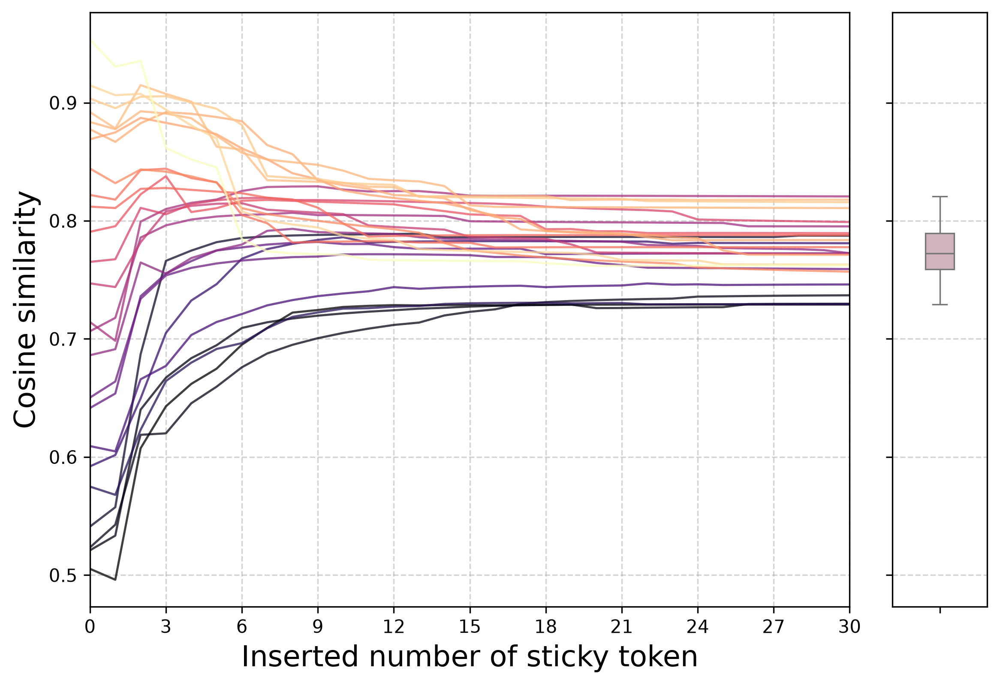
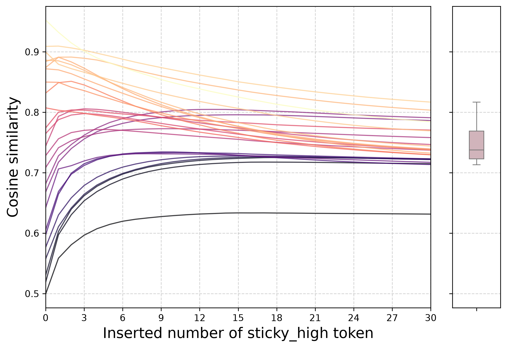
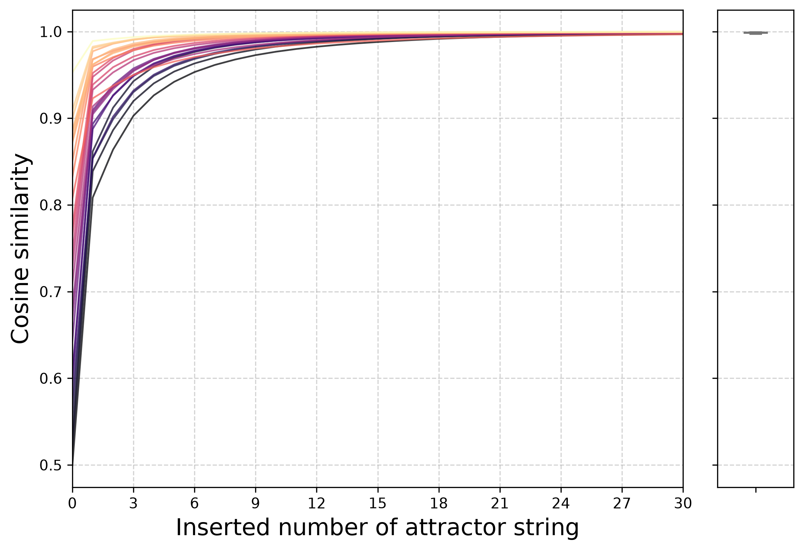
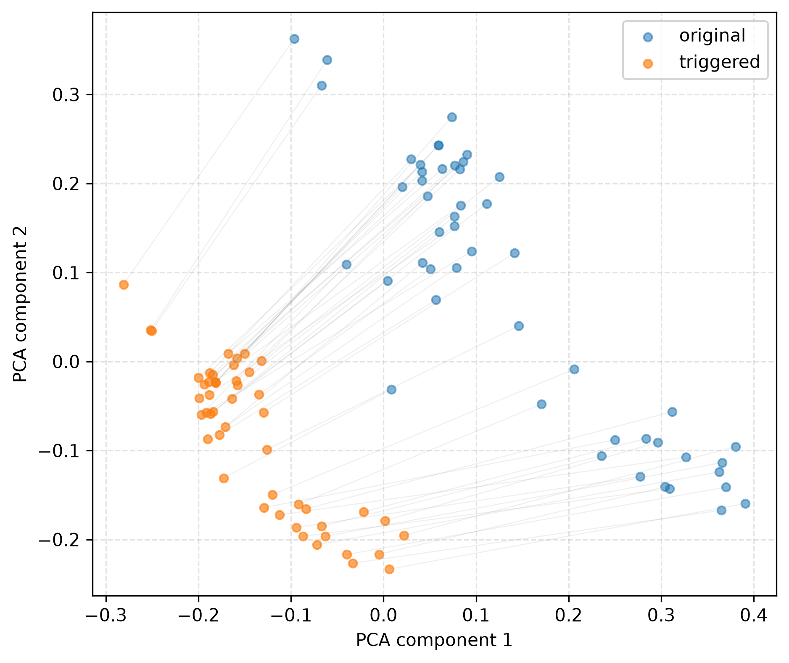

# Sentence-T5-base 三模式第一版全量实验报告

## 实验状态

三条注册流水线均正常退出，远程状态为：

```text
single_sticky=0
multi_booster=0
repulsive_attractor=0
```

环境为 Python 3.11.15、PyTorch 2.6.0+cu124、SentenceTransformers 5.6.1，GPU 为
RTX 4090。模型 revision 固定为
`fc5d4628481afbbaaacd7af6bb07cf9d3865f781`。搜索与验证均显式使用 FP32；
随机种子为 42；长度过滤后共有 976 个句对，search/validation/test 分区大小分别为
196/290/490。所有可移植产物已经过 SHA-256 清单复核。

## 结论概览

| 模式 | 全量范围 | 最终严格认证 | 核心结论 |
|---|---:|---:|---|
| 原论文单-token Sticky | 32,097 个可达 token | 0 | 粗筛候选与论文一致，但固定阈值未通过独立最坏样本认证 |
| 多-token Monotone Booster | 31,994 个 token 全筛；2,321 个 CEM 档案串 | 0 | 低端提升明显，但高端尾部、全局下降率和逐前缀单调性仍冲突 |
| Source-Repulsive Compact Attractor | 1,923 个 CEM 档案串 | 0 | 位移、紧致、低端和高端条件均可满足，但局部 uniqueness 下界仍为负 |

这里的 0 不是程序失败，而是注册约束下的实验结果。三个 `certified_candidates.csv` 都保留
表头但没有数据行；最接近候选及每一项违反量保存在对应 `test_candidates.csv` 中。

## 1. 原论文单-token Sticky

对 32,097 个可达 token 表示使用 FP64 恒等式计算得到：

```text
u = 0.7959119364774819
```

原工程记录值为 `0.7959210872650146`，差约 `9.15e-6`。全词表 Sticky Score 前四名为：

1. `<extra_id_27>`；
2. `</s>`；
3. `<extra_id_26>`；
4. `lucrarea`。

这复现了论文所述 Sentence-T5 异常候选家族。不过，在预注册固定阈值
`epsilon=0.1106` 下，Top 2% 的 642 个候选没有一个通过 validation 或 test 的最大间隙约束。
最接近候选 `<extra_id_27>` 的 validation/test 最大间隙分别为
`0.145655` 和 `0.119602`。

该差异的含义是：论文式小样本粗筛现象可以复现，但把判据升级为独立分区上的最坏样本认证后，
原候选不能直接获得更强的分布外保证。



## 2. 多-token 单调相似度增强串

全词表单-token search 筛选中，`lucrarea` 单次插入满足 search 上全部注册约束：低端平均增益
`+0.060770`，高端增益 5% 分位 `-0.010027`，动态范围保持率 `0.8413`，
Spearman `0.9765`。它因此进入 256-token 组合池。

CEM 对长度 5 的序列进行 30 轮搜索，产生 2,321 个唯一档案串。独立 test 上最接近的字符串为：

```text
lucrareatial senzati sportingenţă
```

对应 token IDs：`30332,10646,28448,15157,17319`。它的 test 指标为：

| 指标 | 数值 | 条件 | 结果 |
|---|---:|---:|---|
| 低端平均增益 | +0.067666 | >= +0.03 | 通过 |
| 低端覆盖率 | 1.0000 | >= 0.70 | 通过 |
| 高端增益 5% 分位 | -0.032727 | >= -0.02 | 失败 |
| 全局显著下降率 | 0.0703125 | <= 0.05 | 失败 |
| 动态范围保持率 | 0.7811 | >= 0.70 | 通过 |
| Spearman | 0.9648 | >= 0.80 | 通过 |
| 逐前缀下降率 | 0.27396 | <= 0.10 | 失败 |
| 文本可实现率 | 1.0000 | >= 0.95 | 通过 |

总归一化约束违反量为 `1.04259`。所以它是一个强低端 booster，但不是所要求的“高端近似不降、
路径也近似单调”的认证串。



该图使用完全未参与搜索和候选选择的 25 个 test 句对。30 次重复后，中位相似度变化为
`+0.00278`，但单句对变化范围为 `[-0.16830,+0.19630]`：低端上升与高端下降同时存在，
正是最终未通过认证的可视化原因。

## 3. 原句排斥的紧致吸引子串

模式三对句对两侧施加共享字符串。独立 test 上最接近的字符串为：

```text
lucrarea earthquake Smartphoneărălucrarea
```

对应 token IDs：`30332,16145,12743,13525,30332`。其 test 指标为：

| 指标 | 数值 | 条件 | 结果 |
|---|---:|---:|---|
| 低端平均增益 | +0.300091 | >= +0.02 | 通过 |
| 高端增益 5% 分位 | +0.026184 | >= -0.02 | 通过 |
| 原句位移 5% 分位 | 0.360891 | >= 0.35 | 通过 |
| 紧致半径 95% 分位 | 0.398993 | <= 0.45 | 通过 |
| 插入后平均两两相似度 | 0.894643 | 报告量 | — |
| `D_q05-rho_q95` | -0.038102 | >= +0.02 | 失败 |
| 文本可实现率 | 1.0000 | >= 0.95 | 通过 |

唯一失败项是保守局部 uniqueness 下界，归一化违反量为 `2.90510`。这说明“样本各自移动较远”
和“触发后总体更紧致”还不足以推出公共中心与全部原句分离；簇半径仍大于可保证的最小位移。



重复 30 次后，25 个 test 句对的最终相似度中位数达到 `0.998994`，范围为
`[0.996703,0.999757]`。这确实是非常强的共享触发坍缩，但不能因此改写为“已证明唯一的新吸引区”。



## 最终判断

第一版已经同时回答了三个不同问题：

1. 论文的 T5 sticky 候选与词元均值可以复现；
2. 多-token 搜索能比单-token 获得更强低端提升，但“高的仍高”和逐步无下降仍是主要瓶颈；
3. 共享触发器可以制造近乎 1.0 的相似度坍缩和明显位移，但严格 uniqueness 不能从平均紧致性自动推出。

下一版最有价值的方向不是简单放宽阈值，而是：允许长度 1--8 的可变长 Pareto 搜索；把高端
CVaR 和逐前缀约束直接纳入 CEM 精英选择；对模式三增加良性聚类中心距离；若目标是文档侧 RAG
注入，则改为直接优化目标查询覆盖率或 Top-k 间隔。
