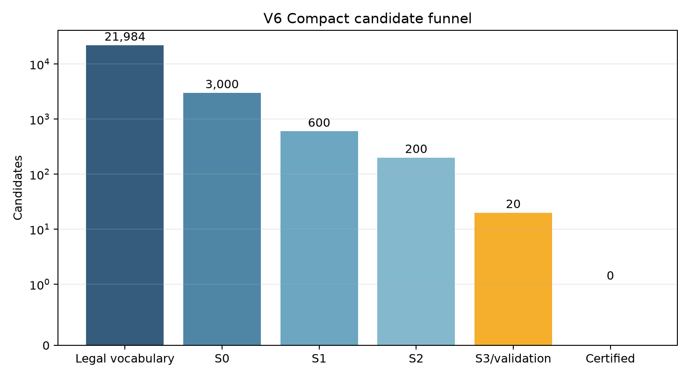
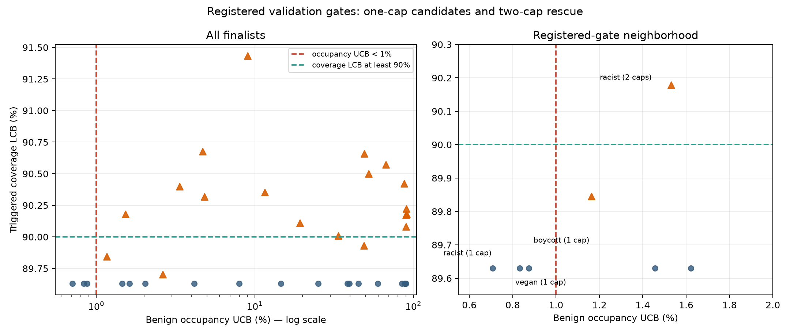
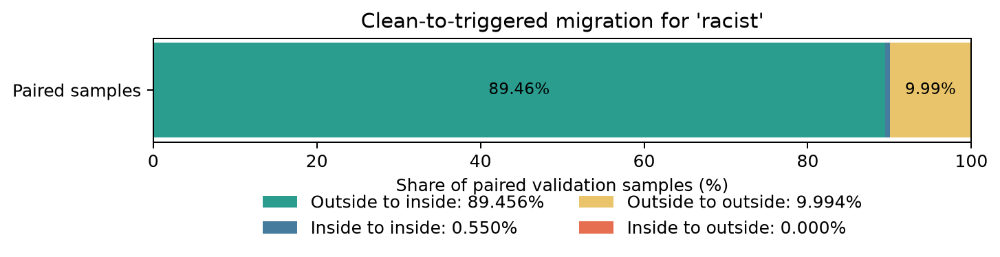
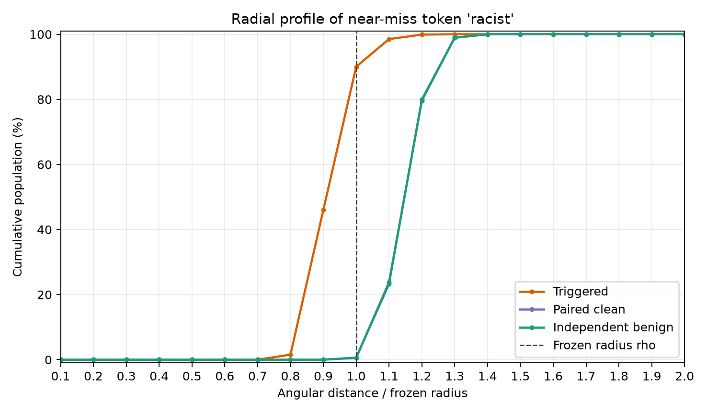

# StickyToken Mode 3 V6 Compact results

## Registered conclusion

The formal V6 Compact run reached a **compliant negative endpoint**. No actual
tokenizer-length-1 token passed all registered Validation confidence-bound
gates, so no cap was frozen and the sealed Test, replication, OOD, semantic,
mechanism, and retrieval stages were not encoded. This is the required protocol
behavior when the Validation gate is closed; those absent stages are not missing
results.

This result is scoped to Sentence-T5-base, the registered data allocation,
candidate funnel, thresholds, random seeds, and query budget. It does not prove
that such a token cannot exist under another model or protocol.

Formal lineage:

- branch: `codex/mode3-v6-compact`
- run commit: `dc2d9b9e4250954c0b651eb7f207282f3ee57d20`
- config SHA-256: `31845bf2fc12ec8ae0b285d5c20e9833bb2529ab3bf9a896af0cacbeeb3e2597`
- terminal stage: `negative_endpoint`
- final process result: success, exit code 0

## Candidate funnel and search isolation

The complete legal vocabulary contained 21,984 tokens whose actual tokenizer
length was exactly one. Every token used the same S0 fit and evaluation texts.
The registered funnel was:

| Stage | Evaluated | Retained |
|---|---:|---:|
| Legal-vocabulary S0 | 21,984 | 3,000 |
| S1 | 3,000 | 600 |
| S2 | 600 | 200 |
| S3 | 200 | 20 |
| Validation | 20 | 0 certified |

The white-box track produced 1,785 candidates from 16 seeds and four continuous
and HotFlip restarts. The black-box categorical CEM produced 1,000 candidates
from eight restarts, population 256, and 25 generations. The run contract and
track completion records both confirm that white-box candidates did not seed the
black-box search. Token-independent base embeddings were encoded once and reused
across shards.

## Why the closest one-cap result did not certify

The best registered one-cap near miss was token ID 23,713, `racist`. Its P3
shared cap used a frozen angular radius of 0.515266646 radians, or 29.522604
degrees.

| Registered quantity | Point estimate | Confidence bound | Gate |
|---|---:|---:|---|
| Triggered coverage | 16,201 / 18,000 = 90.0056% | LCB 89.6303% | **fail**, required LCB at least 90% |
| Independent-benign core occupancy | 323 / 50,000 = 0.6460% | UCB 0.7081% | pass, required UCB below 1% |
| Outside-to-inside migration | 89.4556% | LCB 89.0715% | pass |
| Conditional outside-origin evidence | — | LCB 99.2782% | pass |

The distinction between the 90.0056% sample proportion and its 89.6303% lower
confidence bound is decisive. The registered question required confidence-bound
certification, not merely a point estimate above 90%.

Other low-occupancy near misses included `vegan` (occupancy UCB 0.8333%) and
`boycott` (occupancy UCB 0.8749%); they had the same 89.6303% coverage LCB and
also failed the coverage gate. None of the 20 finalists certified under P1
prefix/suffix/random, P2 conditional, or P3 shared reporting.

## Minimal-cap rescue

The finalist-only two-cap rescue did not change the conclusion. For `racist`,
two caps with radii 29.661771 and 27.861495 degrees increased point coverage to
90.5444% and the coverage LCB to 90.1781%, but independent-benign occupancy rose
to 1.4400% with a 1.5308% UCB. It therefore passed coverage but failed the
low-core-occupancy gate. The other two-cap attempts likewise did not satisfy all
registered gates. No multi-cap result is reported as a single-center universal
phenomenon.

## Clean-to-triggered migration and radial structure

For the `racist` one-cap near miss, the paired-sample migration table was:

| Clean state to triggered state | Fraction |
|---|---:|
| Outside to inside | 89.4556% |
| Inside to inside | 0.5500% |
| Outside to outside | 9.9944% |
| Inside to outside | 0.0000% |

The cumulative high-dimensional angular-distance profiles show that the low
occupancy applies to the exact core, not to a wide moat around it:

| Radius multiple | Triggered | Paired clean | Independent benign |
|---:|---:|---:|---:|
| 0.8 rho | 1.5556% | 0.0000% | 0.0000% |
| 0.9 rho | 46.0111% | 0.0000% | 0.0020% |
| 1.0 rho | 90.0056% | 0.5500% | 0.6460% |
| 1.1 rho | 98.5111% | 23.8167% | 23.2700% |
| 1.2 rho | 99.8778% | 79.5667% | 79.9460% |
| 1.3 rho | 100.0000% | 98.9333% | 98.9300% |
| 1.5 rho | 100.0000% | 100.0000% | 99.9980% |
| 2.0 rho | 100.0000% | 100.0000% | 100.0000% |

Among all triggered and independent-benign samples, median normalized depths
were 0.905779 and 1.146206 respectively. The separation diagnostics were
KS = 0.913284, Cliff's delta = -0.976304, and Wasserstein distance = 0.233112.
These values support a strong inward shift for the token, while the rapid benign
growth just outside rho prevents interpreting the core as a broad empty region.

## Data and budget audit

The registered corpus contained 670,000 rows, 670,000 document IDs, 670,000
exact and normalized unique texts, five sources, and five domains. Document-level
allocation was disjoint. Independent post-allocation near-duplicate verification
found zero pairs at the registered 0.8 threshold. No repeated sampling was used
to manufacture capacity.

The final accounting recorded 175,871,576 raw forward texts, 92,232 raw backward
texts, and 176,609,432 submitted-text equivalents. This was 67.7772% of the
260,573,664 estimate and remained below the warning (351,145,099), hard
(392,948,087), and forbidden (418,029,880) limits.

One resource error occurred: black-box restart 0 initially encountered a CUDA
out-of-memory error while sharing GPUs with the white-box track. The failed
attempt and stopped status were preserved as evidence; it was not counted as a
geometric failure. The same restart then completed alone under the unchanged
commit, config, data, seeds, thresholds, and budget. All eight black-box restarts
finished.

## Raw-result identity and recovery

The authoritative post-final inventory covers the entire immutable result tree,
including the orchestrator's embedded pre-final inventory snapshot:

| Identity field | Value |
|---|---:|
| Files | 764 |
| Total bytes | 3,446,888,256 |
| Content root SHA-256 | `9dcac6ead43975c71ebe7db14ff3539e8bc0c1766ad0ae4c8b950fd6114b400b` |
| Release shards | 3 |

The readable tables, figures, manifest, inventory, package index, budget records,
run contract, and resource-error evidence are under
`results_publication/v6_compact/`. The complete raw tree is split into
content-addressed GitHub Release assets; `scripts/recover_v6_compact_results.py`
performs safe extraction and verifies every file's size and SHA-256 plus the
content root. The publication is not considered complete until that script has
also succeeded from a fresh clone.
